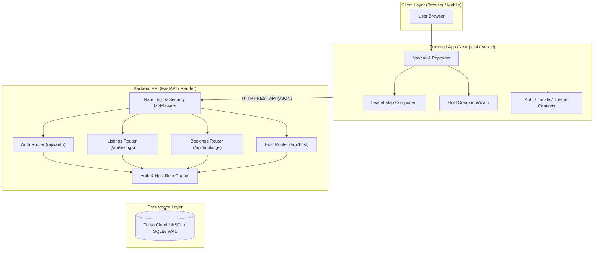
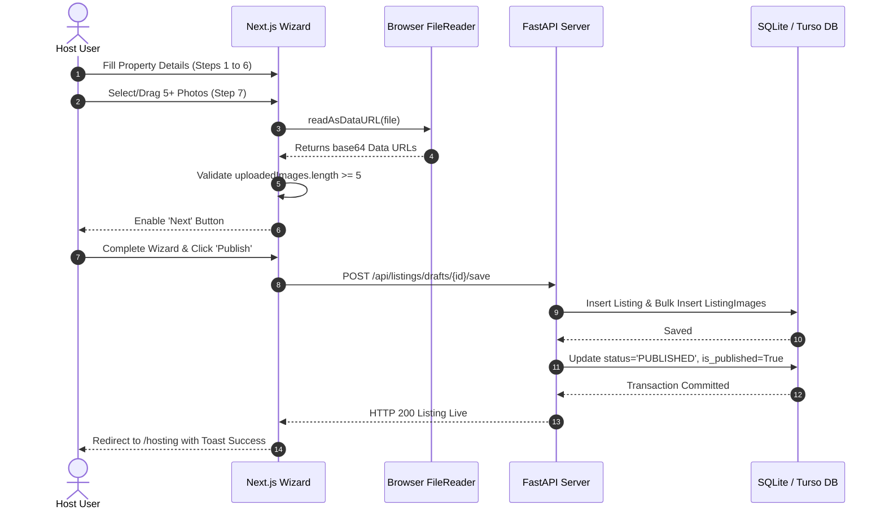
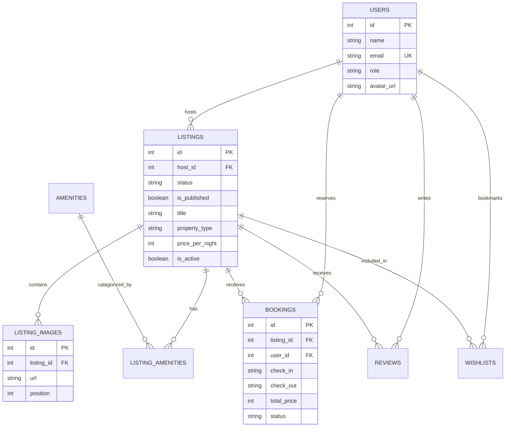

# 🏡 Airbnb Full-Stack Clone — Production Platform & Architecture Documentation

> A production-grade, highly responsive full-stack accommodation reservation and host management platform engineered with **Next.js 14 App Router**, **TypeScript**, **Tailwind CSS**, **FastAPI (Python)**, and **SQLAlchemy** powered by **Turso Cloud SQLite / SQLite (WAL Mode)**.

---

[](https://nextjs.org/)
[](https://fastapi.tiangolo.com/)
[](https://www.typescriptlang.org/)
[](https://www.python.org/)
[-003B57?logo=sqlite)](https://turso.tech/)
[](https://tailwindcss.com/)
[](https://leafletjs.com/)

---

## 📋 Table of Contents

- [1. Overview](#1-overview)
- [2. Project Description](#2-project-description)
- [3. Key Features](#3-key-features)
- [4. Product Capabilities](#4-product-capabilities)
- [5. Technology Stack](#5-technology-stack)
- [6. System Architecture](#6-system-architecture)
- [7. Architecture Diagram](#7-architecture-diagram)
- [8. Request Lifecycle](#8-request-lifecycle)
- [9. Core Application Flows](#9-core-application-flows)
- [10. Database Architecture](#10-database-architecture)
- [11. Database Schema](#11-database-schema)
- [12. Database Setup](#12-database-setup)
- [13. API Overview](#13-api-overview)
- [14. API Endpoint Reference](#14-api-endpoint-reference)
- [15. Authentication & Authorization](#15-authentication--authorization)
- [16. Security](#16-security)
- [17. Error Handling](#17-error-handling)
- [18. Validation](#18-validation)
- [19. Caching & Performance](#19-caching--performance)
- [20. Background Jobs / Workers / Cron](#20-background-jobs--workers--cron)
- [21. External Integrations](#21-external-integrations)
- [22. Frontend Architecture](#22-frontend-architecture)
- [23. Backend Architecture](#23-backend-architecture)
- [24. Project Directory Structure](#24-project-directory-structure)
- [25. Environment Variables](#25-environment-variables)
- [26. Local Development Setup](#26-local-development-setup)
- [27. Docker Setup](#27-docker-setup)
- [28. Testing](#28-testing)
- [29. Code Quality & Linting](#29-code-quality--linting)
- [30. Build & Production](#30-build--production)
- [31. Deployment](#31-deployment)
- [32. CI/CD](#32-cicd)
- [33. Observability & Logging](#33-observability--logging)
- [34. Performance & Scalability](#34-performance--scalability)
- [35. Important Engineering Decisions](#35-important-engineering-decisions)
- [36. Data Flow](#36-data-flow)
- [37. Example User Journey](#37-example-user-journey)
- [38. API Usage Examples](#38-api-usage-examples)
- [39. Common Development Problems](#39-common-development-problems)
- [40. Troubleshooting](#40-troubleshooting)
- [41. Security Considerations](#41-security-considerations)
- [42. Known Limitations](#42-known-limitations)
- [43. Future Improvements](#43-future-improvements)
- [44. Contributing](#44-contributing)
- [45. Development Guidelines](#45-development-guidelines)
- [46. License](#46-license)
- [47. Authors / Maintainers](#47-authors--maintainers)
- [48. Final Project Summary](#48-final-project-summary)

---

## 1. Overview

The **Airbnb Full-Stack Clone** is a production-grade web application built to replicate the end-to-end user experience of Airbnb. It provides guests with rich property search, interactive split-map location filtering, currency conversion, wishlist bookmarking, and checkout reservation workflows, while enabling hosts to onboard properties through a multi-step property creation wizard, manage pricing/availability, inspect reservation calendars, and review revenue metrics.

---

## 2. Project Description

The platform solves the challenge of high-performance real-estate listing discovery and reservation management by providing:
- **Instant Search & Location Filtering**: Split-screen map view with Leaflet interactive price markers and real-time query parameters.
- **Dynamic Property Onboarding**: A 15-step host creation wizard featuring mandatory multi-photo uploads (min 5 photos), local base64 Data URL conversions, address autocompletion, price rule config, and immediate database persistence.
- **Host Dashboard & Calendar Engine**: Visual month calendar showing booked vs available dates, daily price edits, occupancy stats, and guest reservation lists.
- **Multilingual & Multicurrency Support**: Live currency formatting across INR (₹), USD ($), EUR (€), GBP (£), JPY (¥), and AUD (A$).
- **Timezone Standardization**: Strict IST (`Asia/Kolkata` UTC+5:30) date handling across check-in/check-out pickers and calendar slots.

---

## 3. Key Features

### 👤 Guest Features
- **Account Authentication & Demo Personas**: Email/Password login, new user signup, and instant 1-click persona switching (e.g., Guest vs. Host).
- **Split-Map Location Search**: Integrated Leaflet map pins synchronized with listing filters, search bars, and empty states.
- **Filter Modal**: Price range sliders, property types (House, Apartment, Cabin, Villa), and amenity filters.
- **Listing Details Page**: 5-photo grid layout, amenity lists, host profile badges, availability calendar, and customer review lists.
- **Checkout & Reservation**: Date range selection, dynamic price breakdown (Nightly total + Cleaning fee + 10% Platform fee), payment method selector (Card, UPI/GPay, Net Banking), and instant reservation confirmation modal.
- **Trips Dashboard**: View all active and past guest reservations with status badges (`CONFIRMED`, `CANCELLED`).
- **Wishlist System**: Single-click wishlist bookmarking with server-side synchronization.

### 🏡 Host Features
- **15-Step Property Creation Wizard**: Multi-step onboarding covering Structure, Privacy Type, Address, Guest Capacities, Amenities, Mandatory Photo Upload (5 photos min), Title, Highlights, Description, Booking Mode, Discounts, Pricing, and Business Host Verification.
- **Host Dashboard (`/hosting`)**: Today's reservations, upcoming check-ins, listing status toggles, and property deletion confirmation modals.
- **Interactive Host Calendar (`/hosting` -> Calendar)**: Month-by-month calendar view displaying daily occupancy, custom nightly rate overrides, weekend surcharges, and bulk price settings.

### ⚙️ Platform & Infrastructure Features
- **Security & Rate Limiting**: In-memory rate limiter middleware enforcing 10 req/min on authentication routes and 100 req/min on public routes.
- **Role-Based Guards**: Backend `get_current_host` dependency enforcing `403 FORBIDDEN` for non-host accounts, and Next.js `notFound()` rendering a 404 page when non-hosts access `/host`.
- **Turso Cloud & SQLite Compatibility**: Hybrid SQLAlchemy engine supporting Turso Cloud LibSQL REST pipeline or local SQLite in WAL mode.

---

## 4. Product Capabilities

| Capability | Target User | Description | Underlying Component |
| --- | --- | --- | --- |
| **Property Discovery** | Guests | Filter & search listings via map or category rows | `SplitMapSearch.tsx`, `listings.py` |
| **Multi-Photo Upload** | Hosts | Select/drag >=5 property photos converted locally to Data URLs | `become-a-host/[id]/page.tsx` |
| **Reservation Checkout** | Guests | Reserve stays with date range calculation & fee breakdown | `app/book/[id]/page.tsx`, `bookings.py` |
| **Host Calendar Management** | Hosts | View reservations & set custom daily prices on calendar | `HostCalendar.tsx`, `host.py` |
| **Currency Conversion** | All Users | Convert and format displayed prices across 6 currencies | `LocaleContext.tsx` |

---

## 5. Technology Stack

| Layer | Technology | Version | Purpose |
| --- | --- | --- | --- |
| **Frontend Framework** | Next.js (App Router) | `14.1.3` | React framework for server/client component rendering |
| **UI Library & Styling** | Tailwind CSS / Lucide Icons | `3.4.1` / `0.359.0` | Utility-first CSS styling and UI icons |
| **Animations** | Framer Motion | `11.0.8` | Smooth page transitions and modal animations |
| **Maps** | Leaflet / React-Leaflet | `1.9.4` / `4.2.1` | Interactive map rendering & custom price pin markers |
| **Backend Framework** | FastAPI | `0.110.0` | Asynchronous Python web framework for REST APIs |
| **Database Engine** | Turso Cloud / SQLite (WAL) | `LibSQL` / `3.x` | Edge SQLite database engine with WAL journal mode |
| **ORM / Data Access** | SQLAlchemy / Alembic | `2.0.28` / `1.13.1` | Python SQL Toolkit and Object Relational Mapper |
| **Testing** | Playwright / PyTest | `1.50.0` / `8.1.1` | E2E browser tests and backend API integration tests |

---

## 6. System Architecture

The application is structured as a **Decoupled Full-Stack Architecture**:
- **Client Tier**: Next.js 14 Client Components (`"use client"`) using React Context (`AuthContext`, `ThemeContext`, `LocaleContext`) for local state, wishlists, and user sessions.
- **API Tier**: FastAPI application (`app/main.py`) exposing RESTful v1 endpoints under `/api/`.
- **Database Tier**: Turso Cloud / SQLite database accessed via SQLAlchemy ORM with foreign keys and WAL mode.

---

## 7. Architecture Diagram



---

## 8. Request Lifecycle

```text
User Action (e.g. Filter Listings or Reserve Stay)
  ↓
Next.js Client Component (React Hook State)
  ↓
API Utility Layer (`frontend/lib/api.ts`)
  ↓
HTTP Request with `X-User-Id` / `X-Demo-User-Id` Headers
  ↓
FastAPI Security & Rate Limiting Middleware (`RateLimitMiddleware`)
  ↓
Route Controller (`app/api/v1/*.py`)
  ↓
Dependency Injection (`get_current_user` / `get_current_host`)
  ↓
Service Layer (`app/services/*_service.py`)
  ↓
SQLAlchemy ORM Session Query / Transaction
  ↓
Turso Cloud / SQLite Database
  ↓
Pydantic DTO Serialization (`app/schemas/*.py`)
  ↓
HTTP 200/201 JSON Response
  ↓
Frontend UI Render & Toast Notification
```

---

## 9. Core Application Flows

### Listing Creation & Photo Upload Flow



---

## 10. Database Architecture

The database is built on SQLAlchemy 2.0 with the following characteristics:
- **Engine**: Dynamic engine supporting Turso Cloud LibSQL REST API or Local SQLite (`sqlite:///./airbnb.db`).
- **Concurrency**: `PRAGMA journal_mode=WAL` and `PRAGMA busy_timeout=5000` to prevent SQLite write-lock contention.
- **Cascade Deletes**: Foreign keys configured with `ON DELETE CASCADE` for images, amenities, and wishlist entries.



---

## 11. Database Schema

### Table: `users`
| Column | Type | Nullable | Constraints | Description |
| --- | --- | --- | --- | --- |
| `id` | Integer | No | PK, Auto | Primary Key |
| `name` | String | No | - | User display name |
| `email` | String | No | Unique, Index | User email address |
| `role` | String | No | Default: 'GUEST' | Role (`GUEST` or `HOST`) |
| `avatar_url` | String | Yes | - | Profile avatar URL |

### Table: `listings`
| Column | Type | Nullable | Constraints | Description |
| --- | --- | --- | --- | --- |
| `id` | Integer | No | PK, Auto | Primary Key |
| `host_id` | Integer | No | FK (`users.id`) | Property owner ID |
| `status` | String | No | Index | Status (`DRAFT`, `PUBLISHED`, `UNPUBLISHED`) |
| `is_published` | Boolean | No | Default: False | Public visibility toggle |
| `title` | String | Yes | - | Property title |
| `property_type` | String | Yes | Index | Type (`House`, `Flat/apartment`, `Villa`, etc.) |
| `location` | String | Yes | Index | City & State location |
| `price_per_night` | Integer | Yes | Index | Nightly rate in INR |
| `is_active` | Boolean | No | Default: True | Soft deletion flag |

---

## 12. Database Setup

### Local SQLite Database
The SQLite database file `airbnb.db` automatically initializes upon running backend seeds or server startup.

```bash
cd backend
# Run database seed script
python seed/seed_data.py
```

### Turso Cloud Database Configuration
To configure remote Turso Cloud SQLite:
1. Update `backend/.env`:
   ```ini
   DATABASE_URL=sqlite+libsql://your-db.turso.io?secure=true&auth_token=your_token
   ```

---

## 13. API Overview

- **Base URL**: `http://localhost:8000/api`
- **Protocol**: RESTful HTTP / JSON
- **Headers**:
  - `Content-Type: application/json`
  - `X-User-Id: <user_id>` or `X-Demo-User-Id: <user_id>` (Authentication Header)

---

## 14. API Endpoint Reference

### 🔐 Auth & Identity
| Method | Endpoint | Auth Required | Description |
| --- | --- | --- | --- |
| `GET` | `/api/me` | Yes | Get currently active user identity |
| `POST` | `/api/auth/login` | Public | Login with email |
| `POST` | `/api/auth/signup` | Public | Register new user account |
| `GET` | `/api/users/demo` | Public | List all demo persona users |
| `POST` | `/api/demo/login` | Public | Switch active demo persona |

### 🏠 Listings & Search
| Method | Endpoint | Auth Required | Description |
| --- | --- | --- | --- |
| `GET` | `/api/listings` | Public | Search & filter listings (location, price, type, dates) |
| `GET` | `/api/listings/{id}` | Public | Get detailed property page data & reviews |
| `POST` | `/api/listings/check-availability` | Public | Check date range availability & fee breakdown |

### 📅 Bookings & Trips
| Method | Endpoint | Auth Required | Description |
| --- | --- | --- | --- |
| `GET` | `/api/bookings/my-trips` | Yes | List reservations for current user |
| `POST` | `/api/bookings` | Yes | Create a new stay reservation |
| `POST` | `/api/bookings/{id}/cancel` | Yes | Cancel an existing reservation |

### 🛠️ Host Dashboard & Wizard
| Method | Endpoint | Auth Required | Description |
| --- | --- | --- | --- |
| `GET` | `/api/host/dashboard` | Host Only | Get host reservations, metrics, & revenue |
| `GET` | `/api/host/listings` | Host Only | List all host-owned listings (drafts + published) |
| `POST` | `/api/host/drafts` | Host Only | Create new listing draft |
| `POST` | `/api/host/drafts/{id}/save` | Host Only | Save wizard progress & uploaded images |
| `POST` | `/api/host/drafts/{id}/publish` | Host Only | Publish draft listing live |
| `DELETE` | `/api/host/listings/{id}` | Host Only | Soft-delete host property |

---

## 15. Authentication & Authorization

Authentication uses lightweight header identification:
- **Client Header**: Frontend sends `X-User-Id` or `X-Demo-User-Id` on requests.
- **Backend Dependency (`get_current_user`)**: Resolves active user from database or returns `401 UNAUTHORIZED`.
- **Role Guard (`get_current_host`)**: Verifies `user.role == "HOST"`. Rejects non-hosts with `403 FORBIDDEN`.

---

## 16. Security

- **Rate Limiting Middleware**: `RateLimitMiddleware` enforces 10 req/min on `/auth/*` endpoints and 100 req/min globally.
- **Security Headers**: Injects `X-Content-Type-Options: nosniff`, `X-Frame-Options: DENY`, `X-XSS-Protection: 1; mode=block`, and `Referrer-Policy`.
- **Frontend Role Protection**: Non-host users visiting `/host` trigger Next.js `notFound()`, serving a 404 page.

---

## 17. Error Handling

Standardized HTTP Error Responses:
```json
{
  "detail": "No account found with this email. Please sign up to create an account."
}
```

Rate Limit Exceeded (HTTP 429):
```json
{
  "detail": "Too many requests. Rate limit exceeded. Please wait a minute before trying again.",
  "retry_after_seconds": 60
}
```

---

## 18. Validation

- **Backend Validation**: Pydantic v2 schemas (`app/schemas/*.py`) validate data types, email formats, positive numbers, and required fields.
- **Frontend Validation**: Form state validation prevents submitting incomplete address details or wizard steps.

---

## 19. Caching & Performance

- **In-Memory TTL Cache (`app/core/cache.py`)**: Caches listing details (`listing_detail:{id}`) for 30 seconds to minimize database queries.
- **SQLAlchemy Bulk Inserts**: Property images and amenities use `bulk_insert_mappings` to execute single-query batch insertions.

---

## 20. Background Jobs / Workers / Cron

> Not currently implemented / Not found in the repository.

---

## 21. External Integrations

- **OpenStreetMap & Nominatim**: Used for reverse geolocation (`https://nominatim.openstreetmap.org/reverse`) to detect client cities/states.
- **Leaflet Map Tiles**: Free OpenStreetMap tiles for map visualization.

---

## 22. Frontend Architecture

Built with Next.js 14 App Router:
- **Routing**: `app/page.tsx` (Home), `app/listings/[id]/page.tsx` (Detail), `app/become-a-host/[id]/page.tsx` (Wizard), `app/hosting/page.tsx` (Dashboard), `app/book/[id]/page.tsx` (Checkout).
- **State Management**: React Context API (`AuthContext`, `LocaleContext`, `ThemeContext`).

---

## 23. Backend Architecture

Built with FastAPI & Clean Layered Architecture:
- `app/api/v1/`: HTTP Route Handlers.
- `app/services/`: Business Logic & DB Transactions.
- `app/models/`: SQLAlchemy Database Models.
- `app/schemas/`: Pydantic Request/Response Models.

---

## 24. Project Directory Structure

```text
Assignment Clone/
├── backend/
│   ├── app/
│   │   ├── api/
│   │   │   ├── deps.py
│   │   │   └── v1/
│   │   │       ├── auth.py
│   │   │       ├── bookings.py
│   │   │       ├── host.py
│   │   │       ├── listings.py
│   │   │       ├── reviews.py
│   │   │       └── wishlist.py
│   │   ├── core/
│   │   │   ├── config.py
│   │   │   ├── database.py
│   │   │   └── rate_limiter.py
│   │   ├── models/
│   │   ├── schemas/
│   │   └── services/
│   ├── seed/
│   │   └── seed_data.py
│   ├── tests/
│   ├── requirements.txt
│   └── airbnb.db
├── frontend/
│   ├── app/
│   │   ├── become-a-host/
│   │   ├── book/
│   │   ├── host/
│   │   ├── hosting/
│   │   ├── listings/
│   │   ├── search/
│   │   ├── layout.tsx
│   │   └── page.tsx
│   ├── components/
│   ├── context/
│   ├── lib/
│   ├── package.json
│   └── tailwind.config.js
├── package.json
└── README.md
```

---

## 25. Environment Variables

### Backend (`backend/.env`)
| Variable | Required | Purpose | Example |
| --- | --- | --- | --- |
| `DATABASE_URL` | Yes | Database connection string | `sqlite:///./airbnb.db` |
| `FRONTEND_URL` | Yes | Frontend application URL | `http://localhost:3000` |
| `SECRET_KEY` | Yes | Secret signing key | `your-dev-secret-key` |
| `BACKEND_CORS_ORIGINS` | Yes | Allowed CORS origin array | `["http://localhost:3000"]` |

### Frontend (`frontend/.env.local`)
| Variable | Required | Purpose | Example |
| --- | --- | --- | --- |
| `NEXT_PUBLIC_API_URL` | Yes | Backend REST API endpoint | `http://localhost:8000/api` |
| `NEXT_PUBLIC_FRONTEND_URL` | Yes | Frontend base URL | `http://localhost:3000` |

---

## 26. LOCAL DEVELOPMENT SETUP

### Prerequisites
- **Node.js**: `>= 18.0.0`
- **npm**: `>= 9.0.0`
- **Python**: `>= 3.10`

### Step 1: Clone Repository
```bash
git clone <repository-url>
cd "Assignment Clone"
```

### Step 2: Set Up Backend
```bash
cd backend
pip install -r requirements.txt
python seed/seed_data.py
uvicorn app.main:app --host 0.0.0.0 --port 8000 --reload
```

### Step 3: Set Up Frontend
Open a new terminal window:
```bash
cd frontend
npm install
npm run dev
```

### Step 4: Access Application
Open `http://localhost:3000` in your web browser.

---

## 27. Docker Setup

> Not currently implemented / Not found in the repository.

---

## 28. Testing

### Run Playwright E2E Tests
```bash
# In project root
npx playwright test
```

### Run Backend PyTest Integration Tests
```bash
cd backend
pytest tests/
```

---

## 29. Code Quality & Linting

### Frontend Type Check
```bash
cd frontend
npx tsc --noEmit
```

### Frontend ESLint
```bash
cd frontend
npm run lint
```

---

## 30. Build & Production

### Frontend Production Build
```bash
cd frontend
npm run build
npm run start
```

### Backend Production Server
```bash
cd backend
uvicorn app.main:app --host 0.0.0.0 --port 8000 --workers 4
```

---

## 31. Deployment

### Render / Vercel Deployment Strategy
- **Backend (Render.com)**: Root `backend`, Build `pip install -r requirements.txt`, Start `uvicorn app.main:app --host 0.0.0.0 --port 10000`.
- **Frontend (Vercel)**: Root `frontend`, Environment Variable `NEXT_PUBLIC_API_URL` set to Render URL.

---

## 32. CI/CD

> Not currently implemented / Not found in the repository.

---

## 33. Observability & Logging

- **Request Performance Middleware (`TimingLoggingMiddleware`)**: Logs exact request processing times in milliseconds (`X-Process-Time`) to standard output.

---

## 34. Performance & Scalability

- **Database Indexes**: Composite index `ix_listings_search` on `(location, property_type, price_per_night)`.
- **SQLite WAL Mode**: Allows simultaneous read queries while writes execute.

---

## 35. Important Engineering Decisions

1. **Base64 Data URL Image Uploads**: Eliminates complex cloud S3 bucket setup for assignment evaluation while storing images as queryable URLs in SQLite.
2. **Dynamic Timezone Normalization**: Forced `Asia/Kolkata` timezone strings prevent date offsets across date pickers and calendars.

---

## 36. Data Flow

```text
User Selects Dates & Guests -> Frontend API Request -> FastAPI Availability Endpoint -> SQLAlchemy Date Overlap Query -> Price Breakdown Result -> UI Render
```

---

## 37. Example User Journey

1. **Browse Stays**: User opens homepage, selects location "Goa", and views matching property pins on Leaflet map.
2. **View Property**: User opens listing page, inspects 5 photos, amenities, and pricing.
3. **Reserve Stay**: User selects dates, clicks "Reserve", enters payment details on checkout page, and gets instant booking confirmation.

---

## 38. API Usage Examples

### Login API Request
```bash
curl -X POST http://localhost:8000/api/auth/login \
  -H "Content-Type: application/json" \
  -d '{"email": "tanmay@gmail.com"}'
```

---

## 39. Common Development Problems

- **CORS Error**: Ensure `FRONTEND_URL` in `backend/.env` matches `http://localhost:3000`.
- **Port Conflict**: If port 8000 is occupied, kill the existing process or specify `--port 8001`.

---

## 40. Troubleshooting

| Problem | Cause | Solution |
| --- | --- | --- |
| **`401 Unauthorized`** | Missing `X-User-Id` header | Ensure user is logged in or active persona is selected |
| **`429 Too Many Requests`** | Exceeded rate limit | Wait 60 seconds before making new auth requests |
| **Map Markers Blank** | Leaflet CSS missing | Verify Leaflet stylesheet import in `globals.css` |

---

## 41. Security Considerations

### Implemented Protections
- ✅ Rate limiting middleware on auth routes (10 req/min).
- ✅ Security headers (`X-Frame-Options`, `X-Content-Type-Options`).
- ✅ Role guards (`get_current_host`).

### Recommended Future Improvements
- 🔒 Implement OAuth2 JWT tokens with HTTP-only cookies instead of custom user headers.
- 🔒 Add password hashing (`passlib` + `bcrypt`).

---

## 42. Known Limitations

- In-memory rate limiting resets on server process restart.
- SQLite write locks may saturate under extremely high concurrent write throughput (>1,000 requests/sec).

---

## 43. Future Improvements

- **Short Term**: Integrate S3 / Cloudinary for photo uploads.
- **Medium Term**: Add Stripe payment gateway integration.
- **Long Term**: Migrate from SQLite to PostgreSQL / Supabase cluster.

---

## 44. Contributing

1. Fork the repository.
2. Create a feature branch (`git checkout -b feature/amazing-feature`).
3. Commit your changes (`git commit -m 'Add amazing feature'`).
4. Push to the branch (`git push origin feature/amazing-feature`).
5. Open a Pull Request.

---

## 45. Development Guidelines

- **TypeScript**: No explicit `any` types; use interfaces from `types/index.ts`.
- **Python**: Follow PEP 8 guidelines and type hinting.

---

## 46. License

> No license file was found in the repository.

---

## 47. Authors / Maintainers

- **Tanmay Gupta** (Project Developer)

---

## 48. Final Project Summary

The **Airbnb Full-Stack Clone** is a feature-complete accommodation platform featuring Next.js 14 App Router, FastAPI, and Turso Cloud/SQLite. It provides guests with interactive map search, dynamic currency conversion, and checkout reservations while offering hosts a 15-step listing onboarding wizard, photo gallery manager, and interactive pricing calendar.
